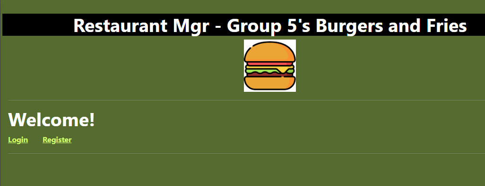
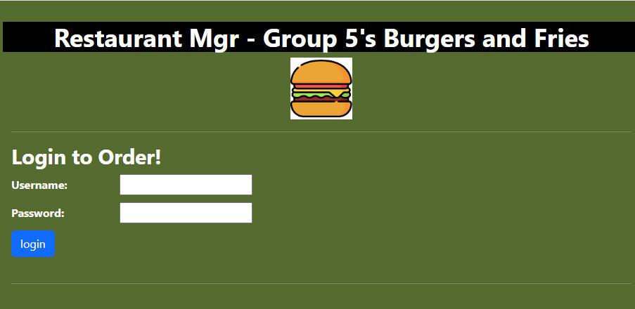
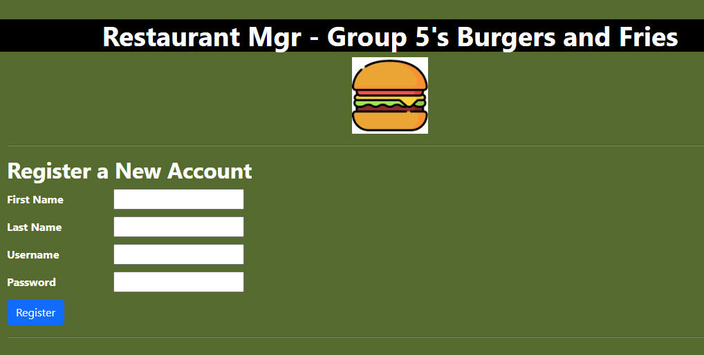
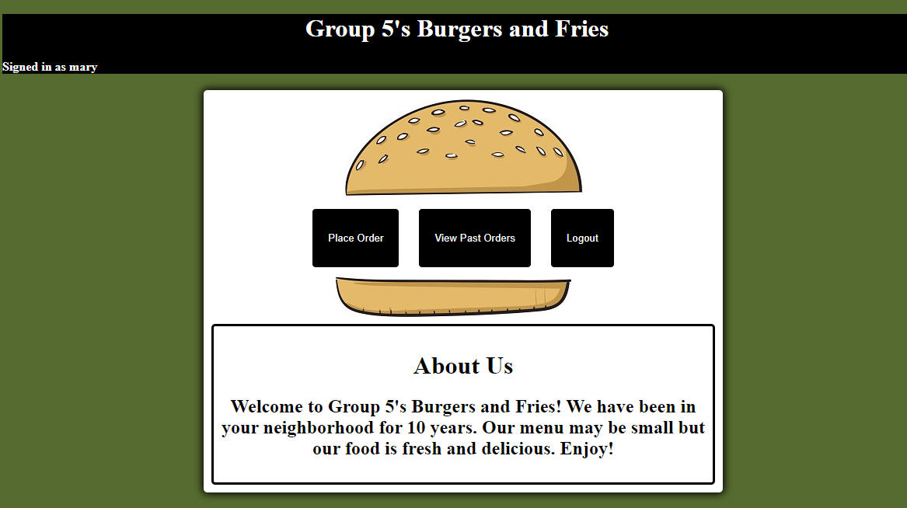
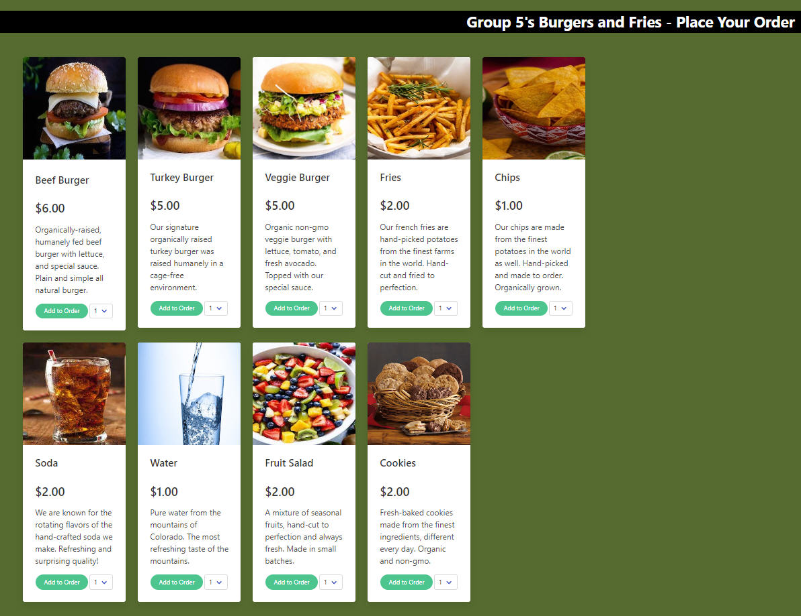
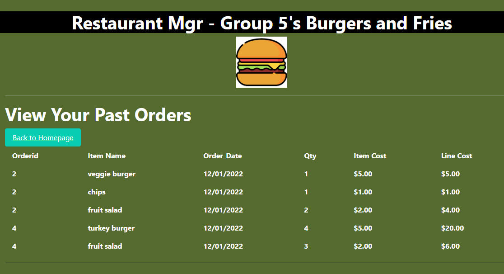
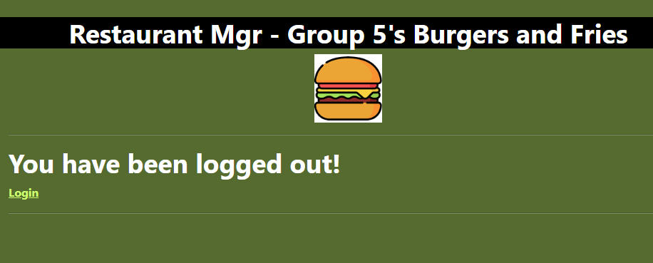

# Restaurant Management System (Interactive Full-Stack Project)

**Link to demo in Heroku:**
https://proj2-restaurant-mgmt-sys.herokuapp.com


## Table of Contents

- [Description](#description)
- [Installation](#installation)
- [Usage](#usage)
- [Credits](#credits)
- [License](#license)
- [Features](#features)
- [How-to-Contribute](#how-to-contribute)
- [Tests](#test-instructions)
- [Questions](#questions)

## Description

<!-- this is `inline-code` here -->

This interactive JavaScript full-stack project is a restaurant management system called "Restaurant Mgr". 

The application can be used by a restaurant to allow customers to log in and place online orders.

**The following technologies and instructions were used:**

```md
• Node.js and Express.js to create a RESTful API.
• Handlebars.js as the template engine.
• MySQL and the Sequelize ORM for the database.
• Both GET and POST routes for retrieving and adding new data.
• At least one new library, package, or technology that we haven’t discussed in class.  This project uses dates-fns to format the order date in vieworder.handlebars (https://date-fns.org/).  We also used Nodemon for testing to automatically restart the local server when it detects changes made to files.
• Have a folder structure that meets the MVC paradigm.
• Include authentication (express-session and cookies).  This project includes register and login pages for customers to login to place online orders from our restaurant "Group 5's Burgers and Fries".
• Protect API keys and sensitive information with environment variables.
• Be deployed using Heroku (with data).
• Have a polished UI.
• Be responsive.  We changed formatting in the handlebars files and tested to ensure the design works on smaller screens, like mobile devices.
• Be interactive (accept and respond to user input).
• Meet good-quality coding standards (file structure, naming conventions, follows best practices for class/id naming conventions, indentation, quality comments, etc).
• Have a professional README (with unique name, description, technologies used, screenshot, and link to deployed application).

```

**User Story**  

```md
As a customer who loves burgers and fries
I want to have a website to order food online
SO THAT I am not hungry
``` 

**Acceptance Criteria**

```md
GIVEN a restaurant ordering system with form inputs
WHEN I log in with my existing login credentials
THEN I am presented with a landing page to either place a new order, view my past orders or logout
WHEN I register as a new customer 
THEN my customer and login data are saved and I am automatically taken to the landing page
WHEN I press the Place Order button to place a new order
THEN I am presented with the menu items, a quantity input field and a button to add amy item to my order
WHEN I am selecting my menu items on the Place Order page
THEN I see a display of my current order and a Place Order button so I can place my order when I am ready 
WHEN I press the Place Order button on the order page to submit my order
THEN my order data is saved in the database
WHEN I am done with my order
THEN I can press the Back to Homepage button to return to the landing page
WHEN I press the View Past Orders button
THEN I see my past orders in a columnar display
WHEN I am done viewing my past orders
THEN I can press the Back to Homepage button to return to the landing page
WHEN I press the logout button on the landing page
THEN I am logged out securely from the application
```

## Installation
<!-- audience is other developers -->
**Note: In package.json, peer dependencies already exist for dotenv, mysql2, sequelize, nodemon and dates-fns so you do not have to install these packages. You should have mysql already installed on your computer.**

1. Clone this GitHub repo https://github.com/abrownstein2022/proj2-restaurant-mgmt-sys:
<!-- Check out the gh cli tool from github -->
```bash
$ gh repo clone /abrownstein2022/proj2-restaurant-mgmt-sys
```
2. From the terminal, install npm:

```bash
$ npm install
```

3. Log into mysql, create the database on your local machine and seed the database:

```bash
$mysql -u root -p < db/schema.sql
$npm run seed-database
```

<!-- [] implies user input 
 mysql> restaurant_mgr < C:\[filename].sql
-->

4. Start the local server and watch for file changes to automatically restart server:
```bash
$ npm run watch 
```

5. Open Express or a browser to test any changes you make to the application after cloning.

## Usage

```md
For the purposes of this exercise:
1. This application is used by one restaurant called "Group 5's Burgers and Fries".
2. This restaurant only accepts online orders.

To use this application, go to the Terminal and type 'npm run watch' and press enter.

A login screen appears for the customer to enter their login and password, or register as a new customer.  

Once logged in, the customer is sent to the landing page with 3 buttons: "Place Order",
"View My Past Orders" and "Logout".  

"Place Order' button
1. Customer see a page to select different food items, and a quantity for each item. 
2. The item price is displayed under each food item name.    
3. Customers can enter as many order lines as they want.
4. Customers see their order items to the right of the page under "Your Order" and a total order cost.
5. When customers are done creating their order, they click the "Place Order" button, and their order data is created in the database, and they are automatically sent to the "View Past Orders" page.
6. If customers do not want to place the order once on the order page, they can press the "Back To Homepage" button to close this screen and return to the landing page.

"View Past Orders" button
1. Customers see only their past order information.
2. Customers press the "Return To Homepage" button to close this screen and return to the landing page.

"Logout" button
1. Customers press this button to securely log out of the application.

**Please review to the screenshots below to view our application:**
```















## Credits

```md
Group 5 team members: Kweku Adarkwa, Justin Anderson, Alexis Brownstein, Ryan Dong, Luana Paredes, bootcamp instructor, TAs and bootcamp tutor: Phil, and Wyzant tutor: Mike
```

## License

 ```md
 MIT 
```

Link to license text:
https://opensource.org/licenses/mit-license


## Features

<!-- 
# h1
###### h6
**bold**
*italic*
_underline_

| key | value |
|-|-|
| name | 'bob' |


- list
- items

1. numberd
1. list
1. all ones - auttomatic numbering
Feattures for *future* development
 -->
**The main features in this project are:**<br>
1. Node.js and Express.js to create a RESTful API
1. Handlebars.js as the template engine
1. MySQL and the Sequelize ORM for the database
1. Both GET and POST routes for retrieving and adding new data (create customer registration and order data in database, view order data)
1. Dates-fns to format the order date in vieworder.handlebars (https://date-fns.org/)
1. Nodemon for testing to automatically restart the local server when it detects changes made to files
1. Folder structure that meets the MVC paradigm
1. Authentication (express-session and cookies in login and registration pages)
1. Protect API keys and sensitive information with environment variables
1. Deployed using Heroku (with data)
1. Polished UI
1. Interactive and responsive design
1. Meets good-quality coding standards 
1. Professional README

**Future Development Features**<br>
If we had more time to complete this school project, we would like to have made the following enhancements to our application:

1. Add logic for customers to update their own data
1. Add logic for employers to use the application to update food and beverage items, and order and customer data
1. Add logic for the application to handle multiple restaurants
1. Add logic for phone and delivery orders
1. Capture more field values in each database table
1. Check for username already existing before allowing a new username and password to be saved
1. Add “forgot password” logic
1. Improve order page by dynamically getting item_id values


## How-to-Contribute

N/A

## Test Instructions

N/A

## Questions

Feel free to contact us with any questions.

We can be reached at alexis@drdatabase.com.

This GitHub repo can be found at:
  
https://github.com/abrownstein2022/proj2-restaurant-mgmt-sys
 
